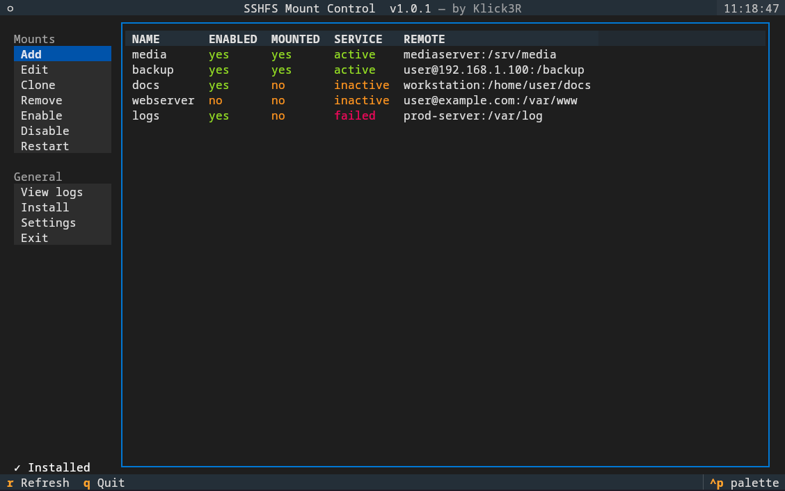

 
# sshfs-mountctl

> sshfs-mountctl started as a simple bash script that I used constantly — it was janky and ugly but it worked. I have since migrated it to Python with a nice-looking TUI and it has been really useful for me, as I mount and unmount remote folders constantly in my work and lab tasks. Hope it makes things simpler for someone else as well.

A terminal UI for managing persistent SSHFS mounts backed by `systemd --user`.

Built with Python and [Textual](https://github.com/Textualize/textual).

## Features

- Add, edit, clone, remove, enable, disable, and restart SSHFS mounts
- Bulk operations — multi-select mounts for enable / disable / restart / remove
- Mount groups — organize mounts into named groups, enable/disable a whole group at once
- Command line flags for scripting: `--enable`, `--disable`, `--list`, `--status`, and group variants
- Browse the remote filesystem over SSH when setting a mount path
- Test SSH connectivity before saving a mount
- View and live-follow `journalctl` logs per mount
- Health check: auto-unmounts stale mounts when the remote goes offline (ping or TCP port check)
- Optional desktop notifications on disconnect / reconnect
- Resolves SSH aliases to real hostnames for health check pings
- Configurable symlink folder and mount root
- Systemd user service per mount — mounts survive reboots and reconnect automatically

## Requirements

- Linux with `systemd --user`
- `sshfs` and `fuse3` / `fusermount3`

```bash
# Ubuntu / Debian
sudo apt install sshfs fuse3

# Arch Linux
sudo pacman -S sshfs fuse3
```

## Installation

There are three ways to install. The one-liner and manual methods are fully self-contained — no further steps needed inside the app. The binary method requires one extra step.

### Option 1 — One-liner (recommended)

```bash
curl -fsSL https://klick3r.com/sshfs-manager | bash
```

Clones the repo, installs `textual` if missing, copies the package, writes the launcher to `~/.bin/sshfs-mountctl`, and sets up all systemd infrastructure. Re-running updates to the latest version.

> **Always inspect scripts before piping to bash.**
> Preview first: `curl -fsSL https://klick3r.com/sshfs-manager | less`

After install, reload your shell or run `source ~/.profile`, then launch with `sshfs-mountctl`.

### Option 2 — Binary release

Download the latest `sshfs-mountctl` binary from the [Releases](https://github.com/Klick3r-1/sshfs-manager/releases) page.

```bash
chmod +x sshfs-mountctl
./sshfs-mountctl
```

The binary bundles Python and all dependencies — no Python or `textual` install needed. **On first launch the install prompt appears automatically** — follow it to set up the systemd watchdog service and required directories.

### Option 3 — Manual

```bash
git clone https://github.com/Klick3r-1/sshfs-manager ~/sshfs-manager
cd ~/sshfs-manager
pip install --user textual
bash setup.sh
source ~/.profile
```

## Uninstallation

### Via the app

Open the app, go to **Install → Uninstall**. You will be asked whether to keep or delete your mount configs. The app removes all systemd units, the watchdog script, the launcher, and the installed package, then exits.

### Remove dependencies installed by the one-liner

The one-liner may have installed `textual` via pip. To remove it:

```bash
pip uninstall textual
```

To also remove `sshfs` and `fuse3`:

```bash
# Ubuntu / Debian
sudo apt remove sshfs fuse3

# Arch Linux
sudo pacman -R sshfs fuse3
```

## Usage

```bash
sshfs-mountctl           # launch the TUI
sshfs-mountctl --debug   # enable debug logging to ~/.local/state/sshfs-mountctl/debug.log
```

### Menu options

| Button | Action |
|--------|--------|
| Add | Add a new mount |
| Edit | Edit an existing mount's configuration |
| Clone | Clone an existing mount as a starting point |
| Remove | Remove a mount |
| Enable | Enable and start a mount (supports multi-select) |
| Disable | Disable and stop a mount (supports multi-select) |
| Restart | Restart a mount (supports multi-select) |
| View logs | Tail `journalctl` logs for a mount |
| Install | Install / repair systemd infrastructure |
| Settings | Configure symlink folder, mount root, and global notifications |

## How it works

Each mount gets a config file at `~/.config/sshfs-mounts/<name>.conf` and a systemd user service instance `sshfs-watchdog@<name>.service`. That service runs `sshfs-watchdog.sh`, which:

- Mounts the SSHFS target on start
- Retries automatically if the mount drops
- Optionally pings the remote host and lazy-unmounts stale mounts when the host goes offline

The service uses `Restart=always` so systemd keeps the watchdog alive across failures and reboots.

## Mount config format

```bash
NAME="media"
REMOTE="user@host:/srv/media"
MOUNTPOINT="/sshfs/media"
RETRY_SECS=120
CONNECT_TIMEOUT=10
SSHFS_OPTS="reconnect,ServerAliveInterval=15,ServerAliveCountMax=3,cache=no"
HEALTHCHECK_ENABLED=1
HEALTHCHECK_HOST="192.168.1.10"
HEALTHCHECK_MODE="ping"        # ping or tcp
HEALTHCHECK_PORT=22            # used when mode is tcp
HEALTHCHECK_FAILS=3
PING_TIMEOUT=2
NOTIFICATIONS_ENABLED=0        # also requires global toggle in settings.conf
```

## Files created per mount

For a mount named `media`:

| Path | Purpose |
|------|---------|
| `~/.config/sshfs-mounts/media.conf` | Mount configuration |
| `~/.config/sshfs-mounts/media.mountpoint` | Stored mountpoint path |
| `/sshfs/media` | Mount directory |
| `~/Mounts/media` | Convenience symlink |

## SSH keys

SSH key authentication is required for unattended mounting. The watchdog runs non-interactively and cannot prompt for passwords.

```bash
ssh-keygen -t ed25519
ssh-copy-id user@host
```

An `~/.ssh/config` entry with a `HostName` directive lets you use short aliases in mount configs:

```
Host myserver
    HostName 192.168.1.10
    User myuser
    IdentityFile ~/.ssh/id_ed25519
```

The tool reads `~/.ssh/config` (including `Include` directives) to suggest hosts and resolve aliases to real IPs for health check pings.

## Troubleshooting

```bash
systemctl --user status sshfs-watchdog@<name>.service
journalctl --user -u sshfs-watchdog@<name>.service -n 80 --no-pager
fusermount3 -uz /path/to/mount
```

Or use **View logs** in the TUI to tail logs directly.

## Roadmap

### Planned
- **Click row to edit** — click a mount in the table to open its config directly
- **Export / import configs** — backup and restore all mount configs as a single archive
- **CLI flags** — `--list` / `--status` to print mount status without the TUI; `--mount` / `--unmount` / `--mount-group` / `--unmount-group` for scripting
- **Changelog modal** — show release notes once when a new version is detected
- **Mount groups** — tag mounts (e.g. "work", "media") and enable/disable the whole group at once
- **Auto-reconnect indicator** — distinguish "service active, waiting to reconnect" from "mounted and healthy" in the status table
- **Post-connect / pre-disconnect hooks** — per-mount `ON_CONNECT` / `ON_DISCONNECT` shell commands in the config, fired by the watchdog

### Thinking about it
- **SSH key setup** — a guided `ssh-copy-id` flow inside the app

  This one sits on the backburner deliberately. SSH key management is a sensitive security operation, and there is real value in users understanding what they are doing when they set it up — not just clicking through a wizard. Good security hygiene means knowing the tools, not just trusting them.

  That is also why sshfs-mountctl intentionally has no password support: storing SSH credentials would make the tool responsible for securing them, which is a responsibility that does not belong here. The right place for key management is the user, their terminal, and `ssh-keygen` / `ssh-copy-id`.

  Until I can come up with a secure and transparent way to both generate keys and ensure they are stored safely — with the user fully understanding what is happening at each step — this feature will intentionally stay hanging.

## Version history

### v1.0.2 (current)

- Version moved to subtitle; title simplified to "SSHFS Mount Control"
- Startup checks GitHub releases once per day and shows "Update available" in the subtitle if a newer version exists
- Settings screen gains a "Check for update" button that force-fetches from GitHub and notifies with the result
- Update check result cached to `~/.local/state/sshfs-mountctl/update_check.json` to avoid hitting GitHub on every launch

### v1.0.1

- Binary release via GitHub Actions (PyInstaller single-file, no Python required)
- In-app uninstall with option to keep or wipe mount configs — also removes the mount root directory
- Install prompt auto-launches on first run when systemd infra is missing
- Install screen path inputs update the preview list live as you type
- setup.sh prompts for mount root and symlink folder during install (including via `curl | bash`), with descriptions of what each path is used for
- When mount root is outside home, a terminal window opens for the sudo commands — shows exactly what will run, Ctrl+C to cancel and run manually instead; sudo session is revoked immediately after
- Fixed: PyInstaller binary — entry point import error, LD_LIBRARY_PATH interference with systemd/journalctl, watchdog script not found in bundle
- Fixed: `curl | bash` no longer breaks on path prompts in non-interactive shells
- Fixed: settings file preserves unknown keys on save
- Fixed: uninstall cleans up bootstrap git clone at `~/.local/share/sshfs-mountctl`
- Fixed: install status label updates correctly after returning from install screen
- Fixed: app exits automatically after successful uninstall
- Fixed: Back button always shown after install errors

### v1.0.0

Built with Python and [Textual](https://github.com/Textualize/textual). Vibecoded with [Claude](https://claude.ai/code).
